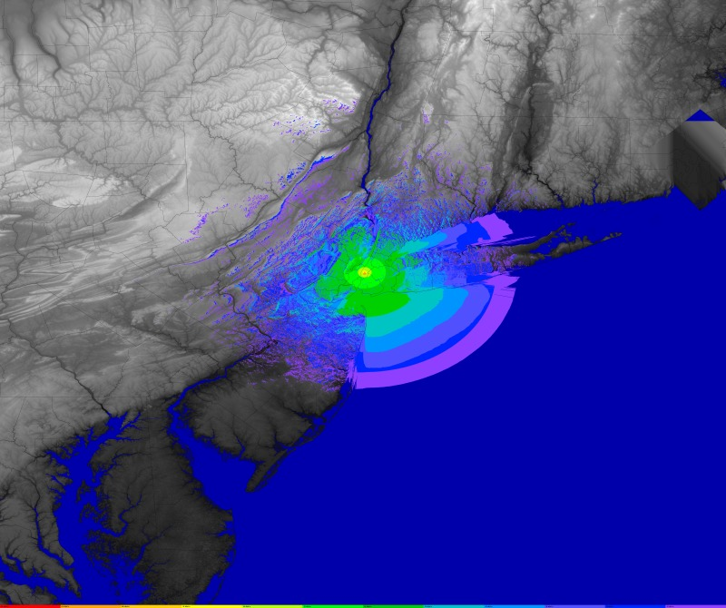

# splat-scripts

Scripts to run the [Splat!](http://www.qsl.net/kd2bd/splat.html) radio terrain
mapping tool.

## Dependencies

This was built and tested on Debian Jessie (8.0) with the following versions:

```
ii  imagemagick    8:6.8.9.9-5  amd64        image manipulation programs -- bi
ii  optipng        0.7.5-1      amd64        advanced PNG (Portable Network Gr
ii  splat          1.4.0-2      amd64        analyze point-to-point terrestria
ii  wget           1.16-1       amd64        retrieves files from the web
```

## Configuration

Edit the shell scripts to set the paths for the SDF elevation files and the
political borders file.

To download and convert the SRTM data use the `get-datafiles*.sh` scripts. Go
get some coffee while this runs, it will take a while. After it is completed,
you should be able to run the example profile as below.

## Usage

```
$ ./splat-radio.sh example.cfg
```

```
$ cat example.cfg
NAME="example"
CALL="KQ2H"
LAT="40.7484931946"
LON="-73.9856567383"
HTAGL="373m"
ERP="250"
FREQMHZ="449.2250"
```

Parameters are as follows:

* NAME: used to uniquely name files
* CALL: will be labeled onto the map
* LAT: latitude, decimal degrees
* LON: longitude, decimal degrees (East is positive)
* HTAGL: height above ground level -- without units the default is in feet; use
  a "m" suffix for meters
* ERP: effective radiated power in Watts -- be sure you take feedline loss and
  antenna gain into account; enter ERP="0" to produce path loss plots
* FREQMHZ: frequency in MHz

## Output



[Full resolution here](example-map.png)

[Height above average terrain, in feet](example-haat.txt)

## Prediction and propagation notes

These predictions are configured to estimate a *simplex* contact, with a
**receiver station at 2 meters (6 feet)**, similar to a mobile station.  This
is not a valid prediction for access to repeater stations on towers.  This of
course can be changed by editing the `splat-radio.sh` script.

The model does not take reflections and multipath into account.

Defaults were chosen for things like ground permeativity and other parameters.
Adjust as needed if your situation warrants it.

